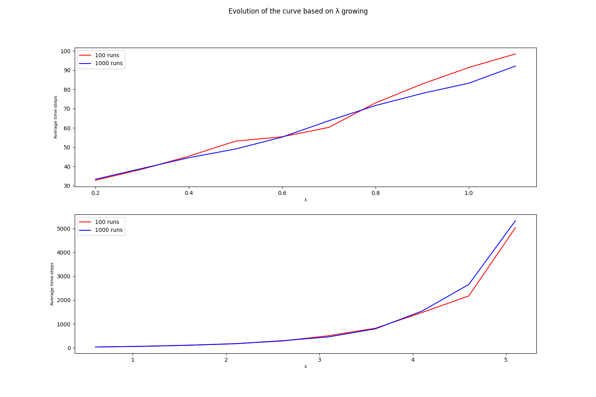

# DS_Contact_Process
### GIADA PALMA - VR471280
Project for the probability and statistics course (Master's Degree Data Science)


The contact process is a discrete Markov chain with state space *S := {0,1}*. *x ∈ S*. So if *xi = 1* we say vertex *i* is *infected*, if *xi = 0* we say vertex *i* is *susceptible*.

The function below returns the index of the neighbours of the current vertex.
```python

def return_neighbour_index(target_index, population):   
    if target_index == 0:
        target_neighbour_index = 1

    elif target_index == len(population) - 1:
        target_neighbour_index = target_index  - 1

    else:
        if np.random.rand() < 0.5:
            target_neighbour_index = target_index + 1
        else:
            target_neighbour_index = target_index - 1
    
    return target_neighbour_index 
```


The function below transforms all infected vertices of a population to susceptible. 
It returns the T (i.e. the time steps needed to reach the absorbing state were all vertices are suceptible).
```python

def return_single_time_value(population_graph, lambda_input):
    time_to_completion = 0

    while sum(population_graph) > 0:
        target_index = randrange(len(population_graph))
        target_neighbour_index = None
        
        target_neighbour_index = return_neighbour_index(target_index, population_graph)
        
        if population_graph[target_index] == 1:
            probability = lambda_input / (1 + lambda_input)
            if np.random.rand() < probability:
                population_graph[target_neighbour_index] = 1
            else:
                population_graph[target_index] = 0
        time_to_completion += 1
    #print("MC",time_to_completion) #Debugging
    return time_to_completion 
```


By the law of large numbers T^ is an estimate for the expected value of T.
The function below returns T^.
```python
def return_average_time_steps(lambda_input, number_of_runs):    
    total_time_steps = 0

    for i in range(0, number_of_runs):
        total_time_steps += return_single_time_value(np.array([1,1,1,1,1,1,1,1,1,1]), lambda_input)
    #print("Total",total_time_steps) #Debugging
    
    average = total_time_steps / number_of_runs
    return average
```

The function below simulates the process by running it a specified number of times, with λ increasing.
It returns two arrays:
- of λ values to be plotted on the x axis  
- of T value for each λ calculated from the runs of the simulation
```python
def simulate(number_of_runs):

    simulations = np.array([])
    array_of_lambdas = np.array([])
    lambda_index = 0.1

    while lambda_index <= 1:
        simulations = np.append(simulations, return_average_time_steps(lambda_index, number_of_runs))
        lambda_index += 0.1
        array_of_lambdas = np.append(array_of_lambdas, lambda_index)

    return simulations, array_of_lambdas
```


The result is the plot below
<br>


